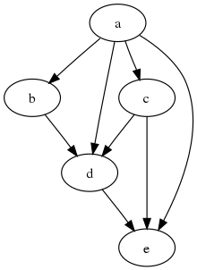

# Modelling the Code Chef Brush fire problem
The [Code Chef brush fire problem](https://www.codechef.com/problems/FIRE) proposes a scenario where a series of bushes around your house are arranged as a Directed Acyclic Graph (DAG) similar to what is shown below:


For this problem, the number of nodes and the relationships between them are dynamic on a per testcase basis and are laid out in the following manner:
```
3 -> Number of testcases present in the file.
3 1 2 -> number of bushes (nodes) in the graph, beginning index on fire, and # of bushes to save respectively.
2 2 3 -> Bush 2 is close to both bush 2 and bush 3
1 1 -> Bush 1 is close to itself only indicating a terminal node in the graph.
1 1 -> Again repeated.
2 3 -> We're to save bushes 2 and 3.
3 1 1 -> Same as above.
2 2 3
1 1
1 1
2
7 1 3
2 2 3
3 1 4 5
3 1 6 7
1 2
1 2
1 3
1 3
4 5 7
```

Depending on the size of our data, I'm going to be looking at anything from a neo4j database, spark graphx, to even using something like the python networkx library. Overall here, we're not using big amounts of data so we can probably get away with using networkx.
